# 半次元研发团队介绍
## 半次元是什么产品？
- 半次元是字节跳动旗下最具特色的社区产品之一，我们致力于做最有爱、最活跃的ACG兴趣社区。
  - 在这里，住着全中国最具创造力的年轻人。
  - “每种爱都很有爱”是半次元的社区宗旨，也是促使他们为爱拿起画笔，穿上COS服，敲击下文字的动力......他们相信，创作的动力来自爱。身为创作者，他们用发自内心的热情和坚持，让爱穿越次元，来到你我面前。
  - 到了今天，半次元已经发展为汇集了绘画，小说，cos，游戏，手工，影视，舞蹈等4000多个圈子的同好，拥有注册用户超2000万人，是ACG领域内容创作及同好交流最活跃的社区之一。

- 我们的官网：https://bcy.net/
- 我们的app：https://bcy.net/static/app
- 我们的看板娘&吉祥物：喵久久+软咩咩+呼呼

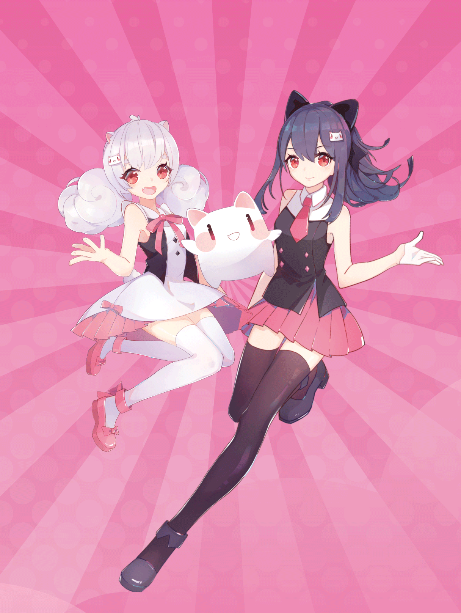
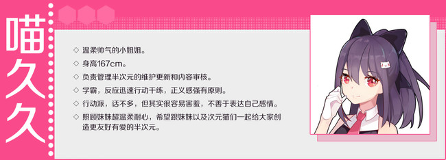
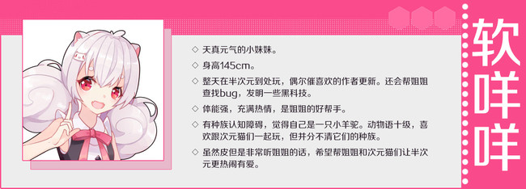

---

## 半次元团队是怎样的一群人？
- 最有爱的产品背后也是最有爱的团队。
- 我们的工作地点 —— 魔都，就是那个台风每次刮过来都要绕个弯远远避开的上海。
- 我们的办公环境：坐落于山不清水秀的闵行区宜山路利丰广场，和大名鼎鼎的韩国街相邻。工位堪比手办博物馆，独立漫画屋免费借阅，- 几十位喜爱二次元文化的小伙伴正对你翘首以盼！

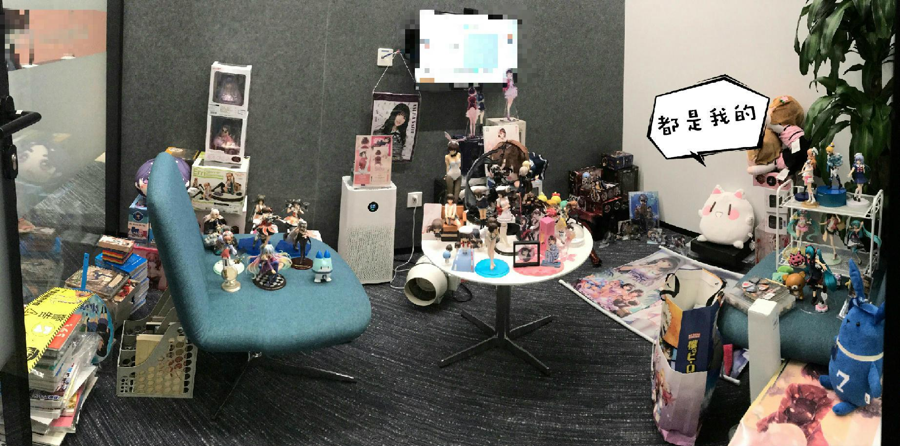
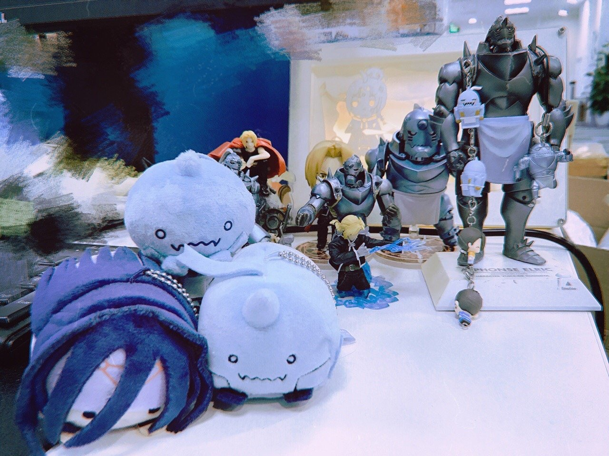
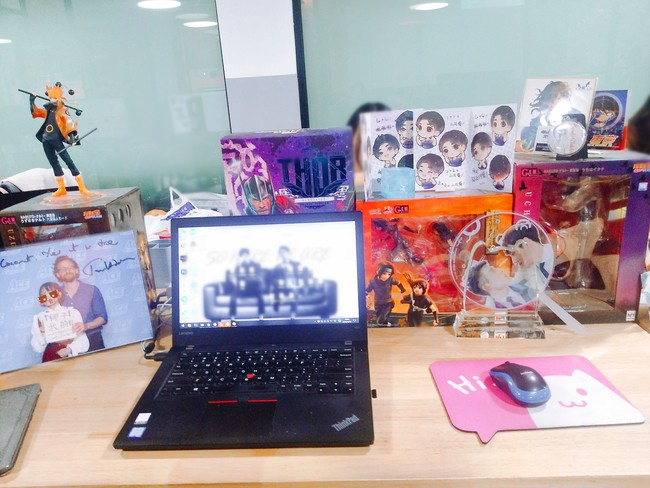
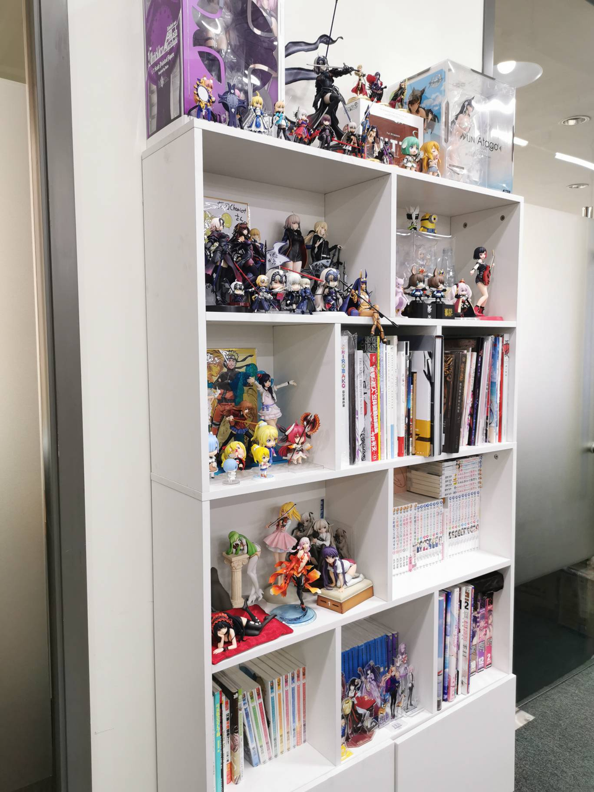
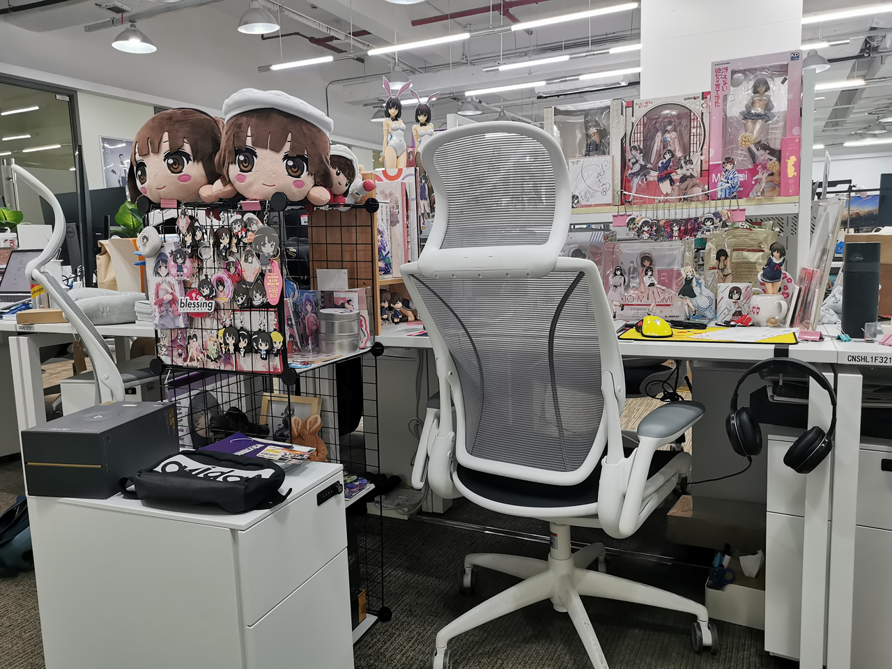

- 我们有晋江半年榜排名第一的顶级写手，文笔缠绵细腻，帮你打造追妹人设代写情书提供恋爱建议，明年七夕不再孤寡孤寡；
- 我们有最还原的coser和最神仙的制服少女，萨菲罗斯降临现实，神级还原度引发惊叹；制服少女转起圈圈，是否萌化你的心？

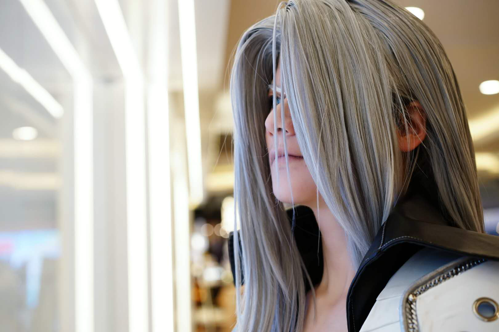

---

## 我们的研发团队：
- 研发团队活动氛围：

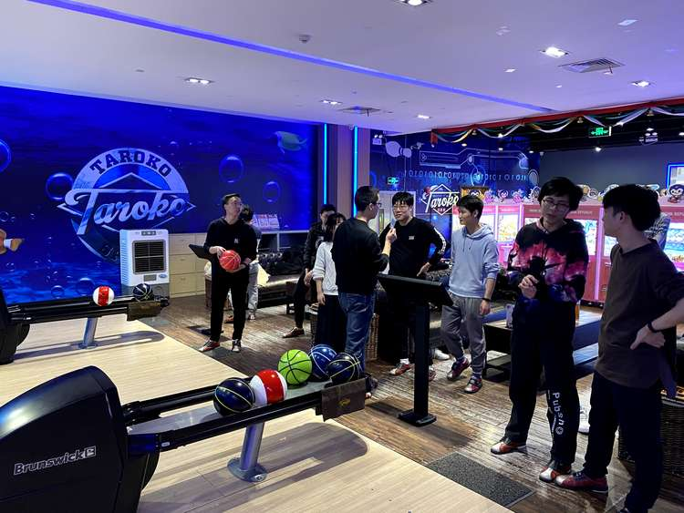
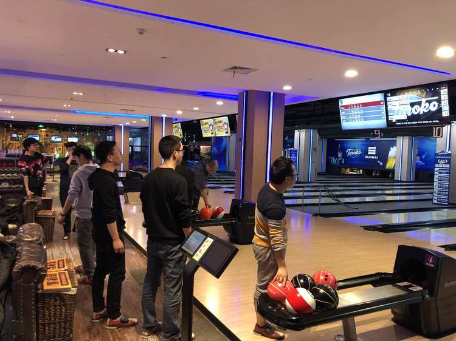
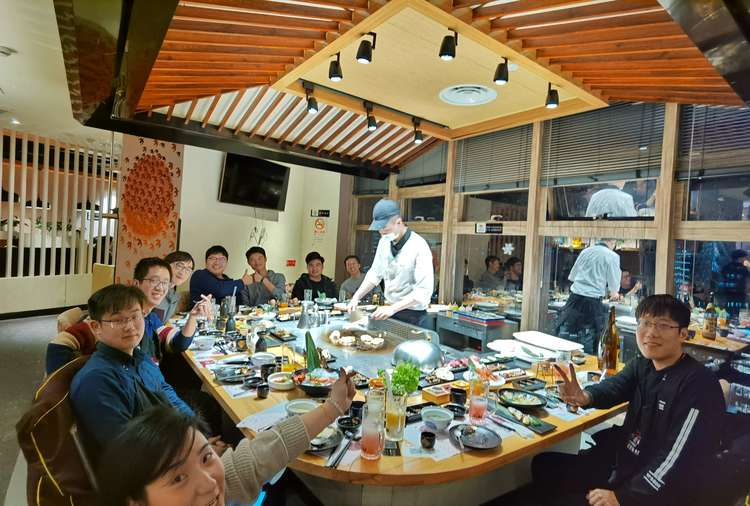
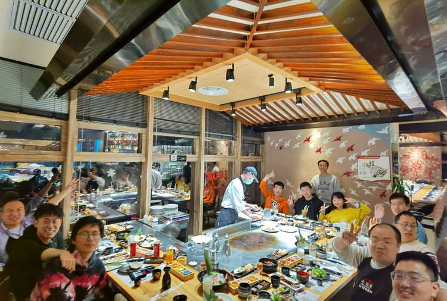
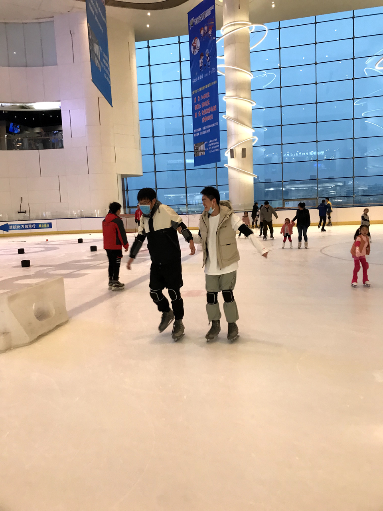

---

ACG+GEEK=半次元

这里不仅是中国最大的专业cosplay社区，

更是二次元与三次元之间的有爱领域。

 

这里没有次元墙，没有办公室政治，

没有打卡机，没有婆媳关系谈，

没有节操(误)，也没有年龄代沟，

有的只是一群(划掉)死宅(划掉)有爱的小伙伴，

 

一起为了梦想而努力！

如果你也喜欢ACG，热爱二次元文化，

那么欢迎你加入半次元团队！

---

# 【岗位需求】

 

##### iOS开发（高级）工程师 
工作内容：
1. 参与或负责某一产品方向的业务迭代、研发
2. 和产品经理配合，深度参与产品需求讨论，功能定义等；
3. 参与或推动产品技术架构设计、改造、
4. 对客户端质量和体验负责，不断提升工程质量。

岗位要求：
1. 良好的沟通能力和合作精神，有责任感；
2. 工作积极、认真、负责
3. 良好的设计和编码品味，热爱写代码能产出高质量的设计和代码；
4. ACG爱好者加分！

 

##### Android开发（高级）工程师 
工作内容：
1. 参与或负责某一产品方向的业务迭代、研发
2. 和产品经理配合，深度参与产品需求讨论，功能定义等；
3. 参与或推动产品技术架构设计、改造、
4. 对客户端质量和体验负责，不断提升工程质量。

岗位要求：
1. 良好的设计和编码品味，热爱写代码能产出高质量的设计和代码；
2. 工作积极、认真、负责
3. 良好的沟通能力和合作精神，有责任感；
4. ACG爱好者加分！

 
