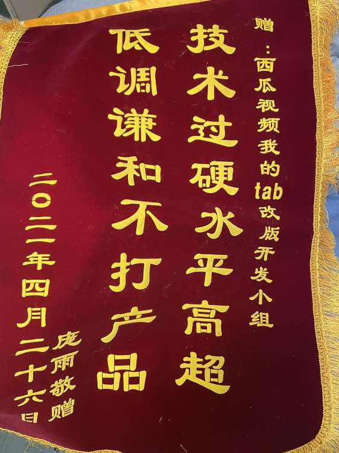
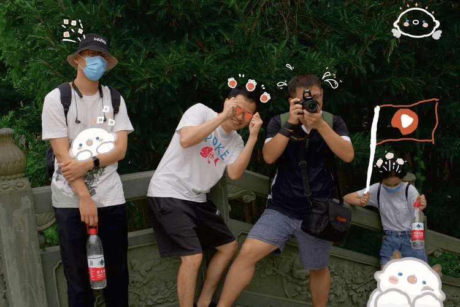
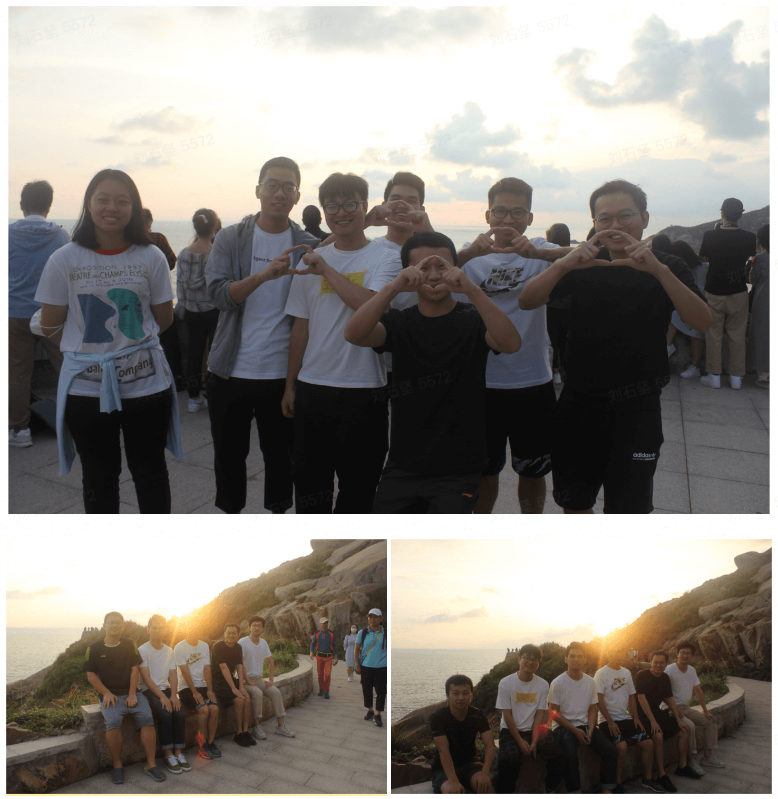
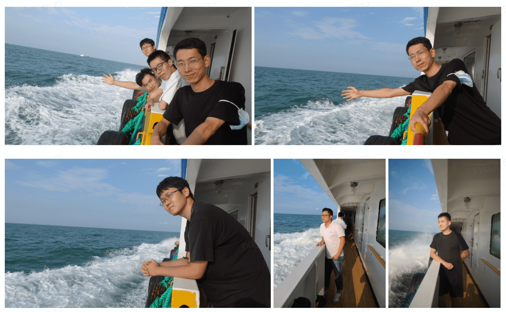
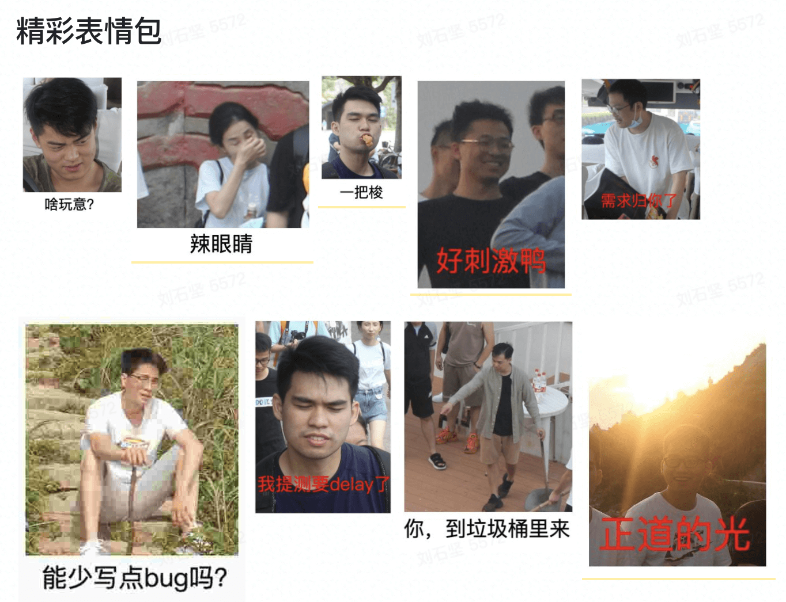

# 西瓜上海团队介绍
> 和优秀的人，做有趣的事情。共创中视频事业

## 🚀 业务介绍

##### 使命
- 让能够生产有深度内容的视频作者，把较长视频作为首选的表达方式，让人们看到丰富有深度的世界，有获得感

##### To C 定位：

- 一个开眼界、涨知识的视频 App。（Informative Video Platform）

##### To B 定位：
- 国内领先的中视频平台。
##### 价值主张：
- 点亮对生活的好奇心
##### 西瓜视频业务介绍
- 西瓜视频是一个开眼界、涨知识的视频 App（Informative Video Platform），作为国内领先的中视频平台，它源源不断地为不同人群提供优质内容，让人们看到更丰富和有深度的世界，收获轻松的获得感，点亮对生活的好奇心。
- 同时，西瓜视频鼓励多样化创作，帮助人们轻松地向全世界分享视频作品，创造更大的价值。目前平台月活跃创作人超过 320 万，月活跃用户数超过 1.8 亿，日均播放量超过 40 亿，用户平均使用时长超过 100 分钟。

---

## 🏆 团队氛围

##### 产研氛围

---

# 🎸 团队建设

##### 团队活动

- [字节、心脏和音符一起跳动了：钢琴吉他打鼓，会写代码会弹唱](https://www.ixigua.com/6923822435963929103?utm_source=iframe_share)
- [果汁分你一半 Cover. 花儿乐队](https://www.ixigua.com/6845260249566282253?utm_source=iframe_share)

##### 舟山之行

